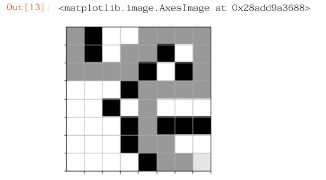

# Pirate Treasure Maze – Deep Q-Learning Agent

In this project, I had the opportunity to develop a fully functional agent that explores a given environment and learns the optimal path from point A to point Z by applying the **Deep Q-Learning (DQL)** reinforcement learning algorithm. To do so, I was given a starter code that defines the map and the steps the agent can take, as well as the rewards it can receive for every properly chosen action in a given state. My portion of the project involved implementing the logic behind how the agent learns the map, e.g., utilizing **TensorFlow**, **Keras** and **NumPy** library frameworks to teach the agent.
In addition to implementing the practical functionality, I explored many of the problems that could surround the emerging trend, such as limitations, ethical and societal implications, the responsibility of developers, users, and companies in using artificial intelligence, and the regulatory bodies, such as GDPR.
With that said, despite the emerging trend becoming an important part in our lives and being evident in almost every industry, from automotive vehicles, production, health care, and security, the technology should be used cautiously and responsibly, as it may contain some bias or lead to unwanted consequences if used not as intended.

---

## Project Overview

- **Goal:** Train an AI pirate agent to find a treasure in a maze with the fewest steps and highest rewards.  
- **Environment:** Custom maze environment (`TreasureMaze` class) that defines:
  - Valid actions (UP, DOWN, LEFT, RIGHT)
  - Reward rules
  - Termination conditions (`win` or `lose`)
- **Learning Method:** Deep Q-Learning (DQL)
- **Frameworks Used:** TensorFlow / Keras, NumPy

---

## How It Works

1. **Environment (`TreasureMaze`)**
   - The maze is a 2D NumPy array of floats:
     - `1.0` → free cell  
     - `0.0` → blocked cell  
   - The pirate starts at `(0,0)` and must reach the treasure at the bottom-right corner.
   - Rewards are given for valid moves and reaching the treasure.
   - Penalties are applied for invalid moves, revisiting cells, or hitting walls.

2. **Agent (Deep Q-Learning)**
   - A neural network approximates the **Q-function**.
   - Uses **ε-greedy exploration** (balance between exploring and exploiting).
   - **Experience replay** is used to train from past experiences.
   - The model learns the optimal action policy through repeated episodes.

3. **Training**
   - The agent plays multiple **episodes**, learning from its experiences.
   - Each episode ends when:
     - The pirate finds the treasure (**win**)
     - The total reward falls below the minimum allowed (**lose**)
   - Progress is printed per epoch:
     ```
     Epoch: 005/14999 | Loss: 0.0006 | Episodes: 34 | Win count: 0 | Win rate: 0.000 | time: 11.15 minutes
     ```
4. **Results**
    - The agent should find a path from the starting position to the target (treasure).
    - The treasure is located in the bottom-right corner.
    - Example of a solved maze: 
   
   
---

