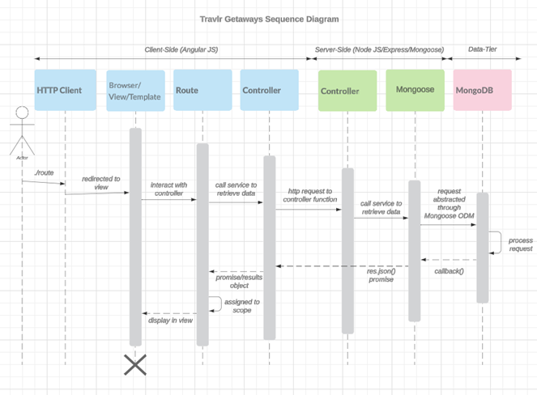
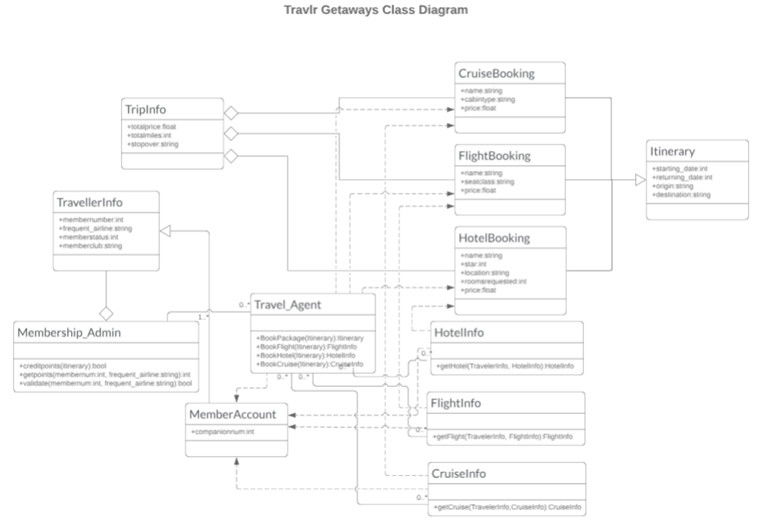
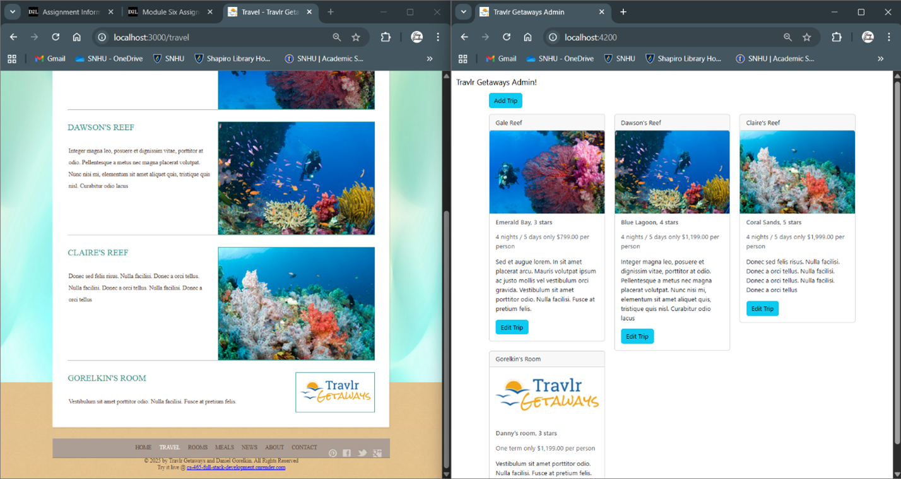
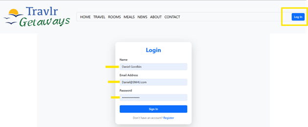
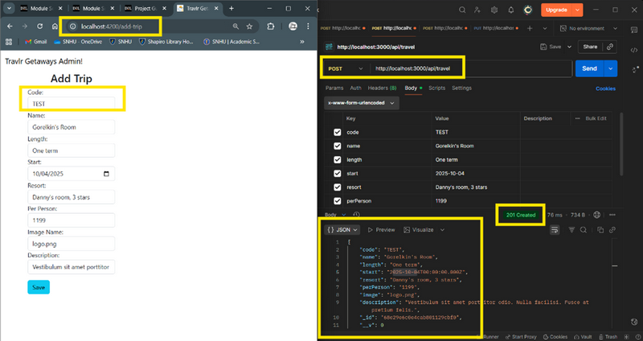
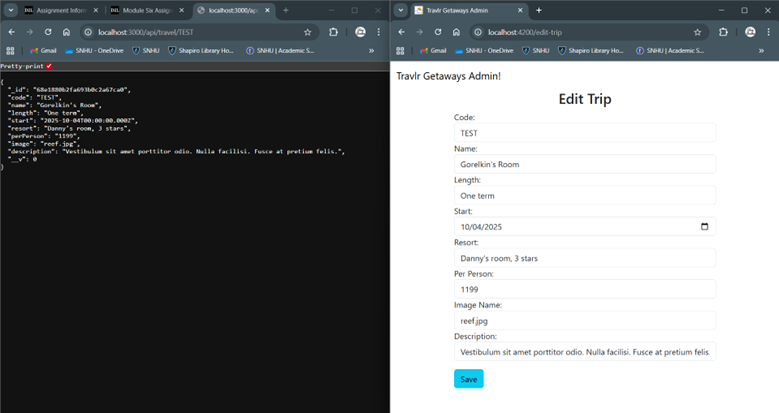

# 🌍 Travlr Gateways

**Travlr Gateways** is a full-stack, responsive travel booking platform built on the **MEAN** (MongoDB, Express, Angular, Node.js) architecture.  
It provides two main user-facing applications:
- A **customer-facing website** to explore and book travel packages.
- An **administrator single-page application (SPA)** to manage travel listings and site content securely.

Deployed live at:  
## 👉 **[Travlr Gateways on Render](https://cs-465-full-stack-development.onrender.com)**

---

## 🎥 Watch the demo on YouTube 👇

[](https://www.youtube.com/watch?v=oKxXrsETJoI)

---

## 🧭 Executive Summary

This full-stack development was built upon the MEAN stack to bond the functionality of the back and front ends of the 
application
The user front-end was built using HTML and Handlebars templating, and it communicates with the MongoDB database 
through API endpoints by passing data in JSON format, utilizing Express and Node.

The admin front-end side, however, is built with Angular and structured using the single-page application (SPA) 
methodology, which loads only a single page and updates the page content upon user request, 
thereby separating the user and admin front-end functionalities of the website.

Therefore, MongoDB provides seamless compatibility with JavaScript and the use of BSON (JSON-like) documents for data storage. 
Hence, since JSON is the native data format in JavaScript, data can be transferred between the database, Express.js backend, 
and Angular front-end without the need for relational mapping or data, making the process very efficient.
Using Handlebars in my HTML code helped me to improve functionality and efficiency by rendering the fetched data 
from the database.

Similarly, I refactored my code by first exposing the API endpoints that my application will communicate with the database, 
and then moved the logic to be executed by the front-end so all API calls could be injected and reused through the 
Angular services.
Clearly, testing and security are integral parts of the development process. First, all the api endpoints were tested 
for proper functionality via Postman and were verified to add and retrieve data from the database.

Then, an additional layer of security was added to prevent security threats, such as data breaches and XSS attacks.
With that said, a secure connection by an authentication mechanism and setting Tokens was verified to be functional and secured.
Ultimately, this project was an excellent opportunity to master modern web development principles and the technology 
that stands behind it and links all the parts together.

---

## 🍁 Functionality

Travlr Gateways enables customers to:
- Search, view, and order travel packages.
- Explore hotels, flights, and vacation deals.

Administrators can:
- Securely log in via a protected SPA.
- Add, update, or delete travel packages.
- Manage content directly from a single dashboard.

The platform leverages the **MEAN stack** for high scalability, performance, and maintainability.

---

## ⚙️ System Architecture

Travlr Gateways follows a **three-tier architecture**:

1. **Frontend (Client-Side)**  
   - Built with **Angular** for fast rendering and modular design.  
   - Provides a multi-page experience for customers and an SPA for admin users.

2. **Server (Middleware Layer)**  
   - Implemented with **Node.js** and **Express**.  
   - Handles REST API routes, authentication, and communication with the database.

3. **Database (Backend)**  
   - Uses **MongoDB** to store users, packages, rooms, and contact data.  
   - Communicates via **Mongoose ODM** to ensure clean schema and validation.

---

## 🔐 Design Constraints

While the MEAN stack offers great flexibility, there are some tradeoffs:
- Client-side rendering affects SEO indexing (solved via pre-rendering or Angular Universal).
- MongoDB’s lack of ACID transactions adds complexity for secure payments.
- Angular apps can perform slower on some mobile devices compared to native apps.

Security considerations include:
- HTTPS connections and SSL certification.  
- Protection from NoSQL injections, XSS, and CSRF attacks.  
- Encrypted and validated sessions for authentication.

---

## 🧩 System Diagrams

### 🧱 Component Diagram


This diagram illustrates how the **client**, **server**, and **database** layers interact through APIs and Mongoose connections, ensuring a secure and efficient communication channel.

---

### 🔄 Sequence Diagram


Demonstrates the request/response flow between user actions, API endpoints, and MongoDB CRUD operations.

---

### 🧬 Class Diagram


Represents key entities such as `MemberAccount`, `TravelAgent`, and `TripBooking`, and how they interact within the system.

---

## 🧠 API Endpoints

| Method | Purpose | URL | Notes |
|--------|----------|-----|-------|
| **GET** | Retrieve homepage data (articles, testimonials, media). | `/api` | Returns main homepage content. |
| **GET** | Retrieve all travel packages. | `/api/travel` | Lists all travel packages and associated images. |
| **GET** | Retrieve single travel package. | `/api/travel/:id` | Returns one package (e.g., `/api/travel/DAWR210315`). |
| **GET** | Retrieve hotel packages. | `/api/rooms` | Lists all hotel packages. |
| **GET** | Retrieve single room details. | `/api/rooms/:roomName` | Returns one room (e.g., `/api/rooms/First-Class-Room`). |
| **GET** | Retrieve company contact info. | `/api/contact` | Returns contact details (HQ, phone, etc.). |
| **POST** | Submit contact form. | `/api/contact` | Sends data securely to the database, returns `201 OK` if successful. |

---

## 💻 User Interface

### 🛠️ Homepage User & Admin Screens


---

### 🔒 Admin Login Screen


Only authorized administrators can access the management dashboard.

---

### 📦 Add New Trip Screen


Admins can create new trip entries using a simple and responsive form.

---

### ✅ Updated Trip Confirmation


Reflects successful updates with live data rendering through Angular’s two-way binding.

---

## 🧰 Technologies Used

| Layer | Technology |
|-------|-------------|
| **Frontend** | Angular 17, HTML5, SCSS, TypeScript |
| **Backend** | Node.js 20+, Express.js |
| **Database** | MongoDB (via Mongoose ODM) |
| **API Testing** | Postman, DBeaver |
| **Deployment** | Render.com |
| **Security** | JWT Authentication, HTTPS, CORS Handling |

---

## 🧾 Testing & Validation

API endpoints were tested using:
- **Postman** — for sending GET/POST/PUT/DELETE requests.
- **DBeaver** — for verifying MongoDB CRUD operations.
- **Browser Testing** — verified that updates to the database reflect live on the website UI.

---

## 🚀 Deployment Instructions

To deploy locally:

```bash
# Clone the repository
git clone https://github.com/yourusername/travlr-gateways.git
cd travlr-gateways

# Install dependencies
npm install

# Start the server
npm run start

# Start the Angular app
cd app_admin
npm install
ng serve
